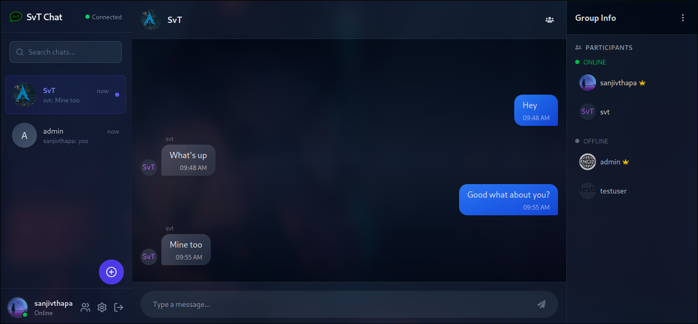

# 💬 Chat App Frontend

This is the frontend for [Django-chat-API](https://github.com/sanjivthapasvt/Django-Chat-api) a full-featured chat application, built with **React**, **TypeScript**, and **Vite**. It supports private and group chats, user authentication, and more. This frontend communicates with a backend via REST APIs and WebSockets.



[](LICENSE)
[](https://vitejs.dev)
[](https://react.dev)
[](https://www.typescriptlang.org/)

---

## 🚀 Features

- 🔐 JWT Authentication (Login/Register)
- 💬 Real-time one-on-one & group messaging
- 🧑‍🤝‍🧑 Friend list and group participants
- 🗂️ Profile management
- 🌐 WebSocket-based live chat
- 🎯 Role-based features (Admin)

---

## 🛠️ Tech Stack

- **React** + **TypeScript**
- **Vite** for build tooling
- **Tailwind CSS** for styling
- **Axios** for API calls
- **WebSocket** for real-time features
- **Context API** for state management

---

## 📁 Project Structure

```
.
├── public/                  # Static assets
│   ├── svt.png
│   └── svt.svg
├── src/                    # Main source code
│   ├── App.tsx             # App entry component
│   ├── main.tsx            # Renders App to DOM
│   ├── index.css           
│   ├── assets/             
│   │   └── svt.png
│   ├── components/         # UI components
│   │   ├── auth.tsx
│   │   ├── ChatRoom.tsx
│   │   ├── Friends.tsx
│   │   ├── Home.tsx
│   │   ├── Notification.tsx
│   │   ├── Profile.tsx
│   │   ├── SideBarChats.tsx
│   │   └── dependencies/
│   │       └── GroupActions.tsx
│   ├── services/           # API and context services
│   │   ├── AuthService.ts
│   │   ├── AxiosInstance.ts
│   │   ├── ChatContext.tsx
│   │   └── interface.ts
│   └── vite-env.d.ts
├── index.html            
├── package.json
├── tsconfig*.json
├── vite.config.ts
```

---

## ⚙️ Setup Instructions

### 1. Clone the repository

```bash
git clone https://github.com/sanjivthapasvt/Chatapp-frontend.git
cd Chatapp-frontend
```

### 2. Install dependencies

```bash
npm install
```

### 3. Configure environment variables

Create a `.env` file in the root with:

```env
VITE_BASE_URL=http://127.0.0.1:8000/api
VITE_WS_URL=ws://localhost:8000/ws
VITE_MEDIA_BASE_URL=http://127.0.0.1:8000
```

### 4. Run the development server

```bash
npm run dev
```

---

## 📌 TODO / Planned Features

- ✅ Notifications
- ✅ Group chat image and room sharing
- ⏳ WebRTC voice/video calling
- ⏳ Emoji picker and file attachments

---

## 🤝 Contributing

Pull requests are welcome!

---

## 📄 License

MIT © 2025 [Sanjiv Thapa](https://sanjivthapa.com.np)